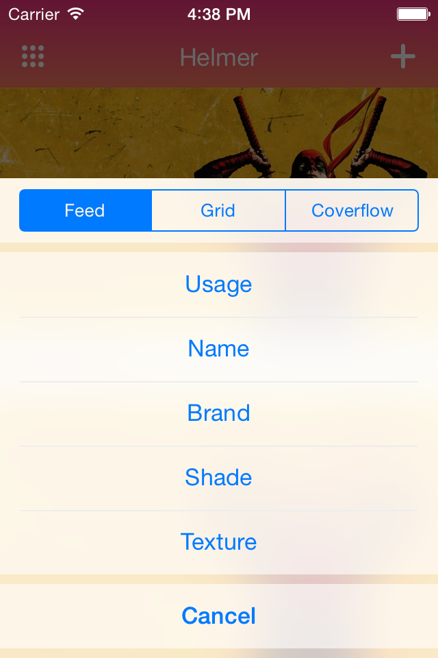

# ODActionViewController

[](http://cocoapods.org/pods/ODActionViewController)
[](http://cocoapods.org/pods/ODActionViewController)
[](http://cocoapods.org/pods/ODActionViewController)

Controller for custom UIActionSheet like in Maps.app.



## Usage

```objective-c
#import <ODActionViewController.h>

- (void)showActionSheet {
    // Simple single action item
    ODActionControllerItem *singleItem = [ODActionControllerItem itemWithTitle:@"Do something" block:^(id sender){
        NSLog(@"Something was done");
    }],

    // Group of items. It will be shown as single section
    ODActionControllerItem *groupItem = [ODActionControllerItem new];
    groupItem.subitems = @[
        [ODActionControllerItem itemWithTitle:@"Do a" block:^(id sender){
            NSLog(@"A was done");
        }],
        [ODActionControllerItem itemWithTitle:@"Do b" block:^(id sender){
            NSLog(@"B was done");
        }]
    ];

    // Our custom item with segmented control
    MYSegmentedActionItem *segmentedItem = [MYSegmentedActionItem new];
    segmentedItem.customCellClass = MYActionSegmentedCell.class;
    segmentedItem.selectedIndex = 1;
    segmentedItem.block = ^(MYSegmentedActionItem * _Nonnull sender) {
        NSLog(@"Idx: %d", (int)sender.selectedIndex);
    };

    UIViewController *vc = [[ODActionViewController alloc] initWithActionItems:@[singleItem, groupItem, segmentedItem] cancelButtonTitle:@"Cancel"];
    [self od_presentActionViewController:vc animated:NO completion:nil];
}
```

## Custom cells

It's possible to use custom cells for action menu. There is property to set cell's class – `customCellClass`. You can see it in example above.
Let's create menu with segmented control like in Apple's Mapps.app. We need to add two new classes: `MYSegmentedActionItem` and  `MYActionSegmentedCell`:

```objective-c
// Action item
@interface MYSegmentedActionItem: ODActionControllerItem
@property (nonatomic, assign) NSUInteger selectedIndex;
@end

// Cell with segmented control
@interface MYActionSegmentedCell : ODActionViewCell
@end
```
implementation:
```objective-c
// Insets for segmented control
static CGSize kCellSegmentInsets = (CGSize){14, 8};

// Empty implementation for item
@implementation MYSegmentedActionItem
@end

// And all logic for our segmented cell
@implementation MYActionSegmentedCell {
    UISegmentedControl *_segmentedControl;
}

- (instancetype)initWithStyle:(UITableViewCellStyle)style reuseIdentifier:(NSString *)reuseIdentifier {
    if ((self = [super initWithStyle:style reuseIdentifier:reuseIdentifier])) {
        // Create our segmented control
        _segmentedControl = [[UISegmentedControl alloc] initWithItems:@[@"Standard", @"Hybrid", @"Satelite"]];
        _segmentedControl.frame = CGRectInset(self.bounds, kCellSegmentInsets.width, kCellSegmentInsets.height);
        _segmentedControl.autoresizingMask = UIViewAutoresizingFlexibleWidth | UIViewAutoresizingFlexibleHeight;
        [_segmentedControl addTarget:self action:@selector(segment_onChange:) forControlEvents:UIControlEventValueChanged];
        [self addSubview:_segmentedControl];
    }
    return self;
}

// You need override this method to configure cell information. It will be invoked in `cellForRowAtIndexPath...`.
- (void)setItem:(MYSegmentedActionItem *)item {
    [super setItem:item];
    _segmentedControl.selectedSegmentIndex = item.selectedIndex;
}

- (void)segment_onChange:(UISegmentedControl *)sender {
    ((MYSegmentedActionItem *)self.item).selectedIndex = sender.selectedSegmentIndex;

    // Check what item is enabled
    if (!self.item.isDisabled && self.item.block) {
        self.item.block(self.item);
    }

    // You need call dismiss method yourself
    if (self.actionDelegate) {
        [self.actionDelegate dismissController];
    }
}

@end
```

## Installation

ODActionViewController is available through [CocoaPods](http://cocoapods.org). To install
it, simply add the following line to your Podfile:

```ruby
pod "ODActionViewController"
```

## Author

Alexey Nazaroff, alexx.nazaroff@gmail.com

## License

ODActionViewController is available under the MIT license. See the LICENSE file for more info.
